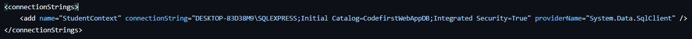
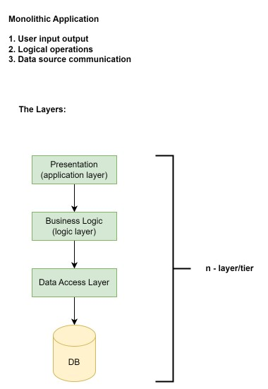

# ASP.NET tutorial

## Database first approach
Contents
<ul type="disc">
	<li><a href="#">Introduction to MVC</a></li>
	<li><a href="#">Form Submission</a></li>
	<li><a href="#">Entity Framework</a></li>
	<li><a href="#">Entity Framework with DTO</a></li>
</ul>

<h2>Introduction to MVC</h2>

	<table>
		<tr>
			<td><b>Steps</b></td>
			<td><b>Breakdown</b></td>
		</tr>
		<tr>
			<td>1</td>
			<td>
				Create <code>PortfolioController</code> first with the necessary methods <code>Bio</code> <code>Education</code> <code>Qualifications</code> <code>References</code>.
	Again create <code>ProductController</code> with the methods <code>Create</code> & <code>List</code>.
			</td>
		</tr>
		<tr>
			<td>2</td>
			<td>
				Add views for the created methods. For <code>Portfolio</code> the views are <code>Education</code> <code>Qualifications</code> <code>References</code>
			</td>
		</tr>
		<tr>
			<td>3</td>
			<td>
				<b><i>Models -> Add -> Class</i></b>.
	Create <code>Degree.cs</code>, <code>Referee.cs</code> in the Models folder created by IDE. These files will contain the properties for initialization
			</td>
		</tr>
		<tr>
			<td>4</td>
			<td>
				Import <code>using IntroMVC.Models</code> in <code>PortfolioController.cs</code>
			</td>
		</tr>
	</table>

<!-- Section - 2 -->
<h2>Steps for Codefirst Setup</h2>

	<table>
		<tr>
			<td><b>Steps</b></td>
			<td><b>Frequency</b></td>
			<td><b>Breakdown</b></td>
		</tr>
		<tr>
			<td>1. Installing EF to project via nuget (needs internet connection)</td>
			<td>1</td>
			<td>Right click on <b>WebApplication</b> folder -> Manage nuget package -> Browse -> Search for <b>EntityFramework</b> -> Install</td>
		</tr>
		<tr>
			<td>2. Initiate Model (Table, Classes & Context)</td>
			<td>1</td>
			<td>Create directory: <b>WebApplication/EF/Tables</b> -> <code>Example.cs</code>, <code>ExampleContext.cs</code> later inherit <code>ExampleContext : DbContext</code></td>
		</tr>
		<tr>
			<td>3. Define connection string in <code>Web.config</code> of solution file</td>
			<td>1</td>
			<td></td>
		</tr>
		<tr>
			<td>4. Enable Migration</td>
			<td>1</td>
			<td>
				Go to Tools -> NuGet package manager -> package manager console   command: <code>enable-migration</code>
			</td>
		</tr>
		<tr>
			<td>5. Adding Migration</td>
			<td>*</td>
			<td>
				Go to Tools -> NuGet package manager -> package manager console   command: <code>add-migration [name]</code>
			</td>
		</tr>
		<tr>
			<td>6. Updating Database</td>
			<td>*</td>
			<td>
				Go to Tools -> NuGet package manager -> package manager console   command: <code>update-database</code>
			</td>
		</tr>
	</table>

<!-- Section - 3 -->
<h2>N-Layer Application</h2>

<h2>Steps for N-Layer Application</h2>

	<table>
		<tr>
			<td><b>Steps</b></td>
			<td><b>Breakdown</b></td>
		</tr>
		<tr>
			<td>1</td>
			<td>Create ASP.NET WebApp with Empty (checked WebAPI only)</td>
		</tr>
		<tr>
			<td>2</td>
			<td>Solution -> Create New Project -> Class Library (.NET Framework) -> BLL -> Next</td>
		</tr>
		<tr>
			<td>3</td>
			<td>Solution -> Create New Project -> Class Library (.NET Framework) -> DLL -> Next</td>
		</tr>
		<tr>
			<td>4</td>
			<td>
				<code>ExampleProject</code> -> Add -> Reference -> <code>BLL</code> -> Add -> Reference -> <code>DLL</code>
			</td>
		</tr>
		<tr>
			<td>5</td>
			<td>Build Solution</td>
		</tr>
		<tr>
			<td>6</td>
			<td>
				Controller -> Add -> <code>ExampleController.cs</code>
			</td>
		</tr>
		<tr>
			<td>7</td>
			<td>
				BLL -> Create Folder -> <b>Services</b> -> <code>ExampleServices.cs</code> -> (change internal to public in the file) 
			</td>
		</tr>
		<tr>
			<td>8</td>
			<td>
				DLL -> Create Folder -> <b>Repos</b> -> <code>ExampleRepo.cs</code> -> (change internal to public in the file) (number of table = number of repos)
			</td>
		</tr>
		<tr>
			<td>9</td>
			<td>
				BLL -> Create Folder -> <b>DTOs</b> -> Add -> <code>ExampleDTO.cs</code> -> (change internal to public in the file) 
			</td>
		</tr>
		<tr>
			<td>10</td>
			<td>
				DLL -> Create Folder -> <b>EF</b> -> Add -> <code>Example.cs</code>, <code>ExampleContext.cs</code> -> (change internal to public in the file) 
			</td>
		</tr>
		<tr>
			<td>11</td>
			<td>
				DLL, Application (both 1st and 3rd) -> Manage Nuget Package -> Install Entity Framework
			</td>
		</tr>
		<tr>
			<td>12</td>
			<td>
				Tools -> Package Manager Console -> Set dropdown to DLL -> command: <code>enable-migrations</code>, <code>add-migration [MN]</code>, <code>update-database</code>
			</td>
		</tr>
		<tr>
			<td>13</td>
			<td>
				BLL -> Manage Nuget Package -> Install AutoMapper by Jimmy Boger v10.0.0
			</td>
		</tr>
	</table>

