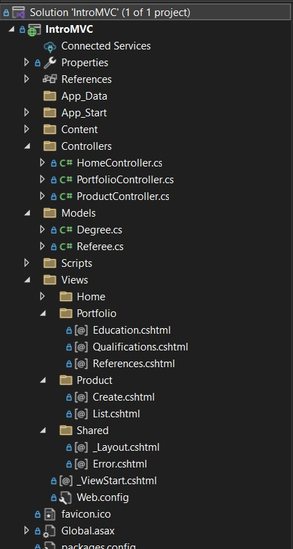
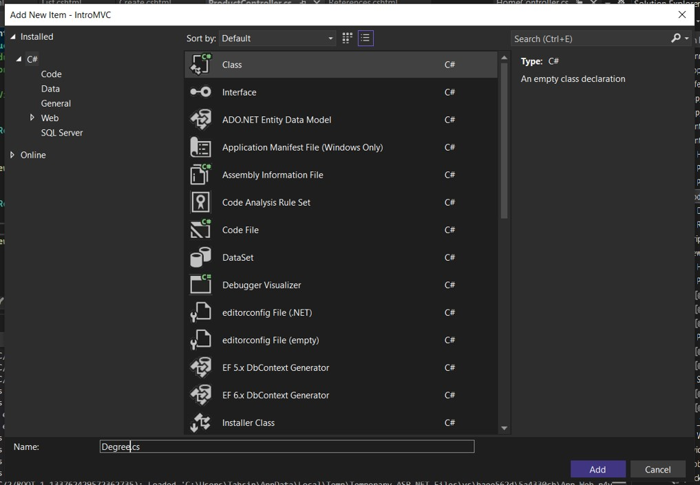

# ASP.NET tutorial

## Database first approach
Contents
<ul type="disc">
	<li><a href="#">Introduction to MVC</a></li>
	<li><a href="#">Form Submission</a></li>
	<li><a href="#">Entity Framework</a></li>
	<li><a href="#">Entity Framework with DTO</a></li>
</ul>

	<h2>Introduction to MVC</h2>
	

		
	

	<b>Step - 1</b>
	

	Create <code>PortfolioController</code> first with the necessary methods <code>Bio</code> <code>Education</code> <code>Qualifications</code> <code>References</code>.
	Again create <code>ProductController</code> with the methods <code>Create</code> & <code>List</code>.
	

	<b>Step - 2</b>
	
Add views for the created methods. For <code>Portfolio</code> the views are <code>Education</code> <code>Qualifications</code> <code>References</code>
	

	<b>Step - 3</b>
	

		
	

	<i>Models -> Add -> Class</i>
	

	Create <code>Degree.cs</code>, <code>Referee.cs</code> in the Models folder created by IDE. These files will contain the properties for initialization
	

	<b>Step - 4</b>
	

	Import <code>using IntroMVC.Models</code> in <code>PortfolioController.cs</code>
	

## Code first approach
Contents

<h2>Steps for code first approach</h2>

<i>(1 -> once, *-> can be done multiple times throughout the project)</i>

	<ol>
		<li>Enable Migration							(1)</li>
		<ol>
			<li>command: <code>enable-migrations</code></li>
		</ol>
  		<li>Adding Migration							(*)</li>
		<ol>
			<li>command: <code>add-migration [name]</code></li>
		</ol>
		<li>Updating database							(*)</li>
		<ol>
			<li>command: <code>update-database</code></li>
		</ol>
	</ol>
[migration -> code to sql]

<h2>Steps for Codefirst Setup</h2>

	<table>
		<tr>
			<td><b>Steps</b></td>
			<td><b>Frequency</b></td>
			<td><b>Breakdown</b></td>
		</tr>
		<tr>
			<td>1. Installing EF to project via nuget (needs internet connection)</td>
			<td>1</td>
			<td>Right click on <b>AppFolder</b> -> Manage nuget package -> Browse -> Search for <b>EntityFramework</b> -> Install</td>
		</tr>
		<tr>
			<td>2. Initiate Model (Table, Classes & Context)</td>
			<td>1</td>
			<td>Create directory: App/EF -> <code>ExampleContext.cs  </code></td>
		</tr>
		<tr>
			<td>3. Define connection string in <code>Web.config</code> of solution file</td>
			<td>1</td>
			<td></td>
		</tr>
	</table>

